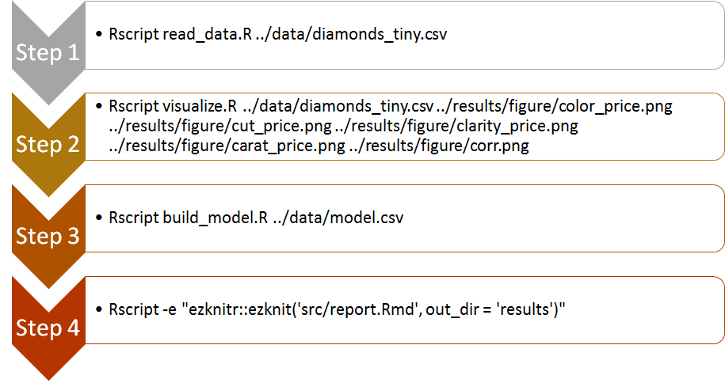

## Diamond Price Project

by Duong Vu, Nov 23, 2017

Last update: Dec 10, 2017.


## Preface

Diamond is one of the world most famous and expensive crystal. Everyone knows that diamonds are charcoal formed deep within the Earth for several billions of year. However, raw diamonds through many treatment processes become precious jewelry. Those treatments add more value to the diamond and increase its price. In this project, I consider four characters of a diamonds that affect its price and focus on the relationship between carat and color on diamond price.


## Project Overview:

Looking at the data of diamond with 10 features, I want to build a model to predict the diamond price base on its features.

1. The dataset that I am using for this project is a dataset of almost 54,000 diamonds, a provided dataset from ggplot2.
2. With this dataset, I'm particularly interested in the how the price of a diamond is determined based on the factor carat and clarity and if possible, the combination of four variable: carat, cut quality, color, and clarity.
3. My main question is that: " Is there any relationship between carat and color in the diamond price?" so the hypothesis will be focused on: "There is no linear correlation between carat and color of a diamond."
4. For this question, I will only use the information from 5 columns: price, carat, cut quality, color, and clarity. The rest of the information can be dropped out of the data. Before doing any analysis, some visualization to show the price by carat, cut quality, color, and clarity will be nice to look at. Then I will fit the data into a linear model to see the relationship between carat and color with the response variable (price).


### Introduction to some variables[^1]:

- **Cut**: "A diamond’s cut refers both to the physical shape of the stone, and to the quality of its finish. A diamond’s brilliance depends on its ability to bend and direct light as it passes through the stone and back to its surface, and the cut of a diamond determines how well the stone is able to do this. " In this dataset, we only consider 5 levels of the cut quality : Fair, Good, Very Good, Premium, Ideal.

  

  ​

- **Colour**: "The colour of a diamond is actually a reference to its lack of colour, or whiteness.  Diamond colour is graded according to the GIA colour scale, from D to Z, with D being the whitest and most valuable shade." In this dataset, we have six levels of colourm from J (worst) to D (best). 

  - Trick: tilt your head to form a 45 degree angle with the screen to see the differences among these colours below.

  

  ​

- **Clarity**: Based on the level of impurities, experts classify how clear the diamond is from I1 (worst), SI1, SI2, VS1, VS2, VVS1, VVS2 to IF (best).

  ​

  

  ​

- **Carat**: Is a measure of the diamond weight, not size of a diamond. 1 carat is equal to 2 gram.

## How to run the project:

1. Simply clone this repository

2. Run the code:

   a. The quick way is to open a bash shell in the repository and type:

```
bash run_all.sh
```

> This will run all the code and return a report.

​	b. The other way is to run each script in the `src`folder. First, open the bash shell in  the `src`folder and follow the script in the flow chart below:



Check out the [README file](src/README.md) in the `src` folder for more detail.


3. Don't forget to check the report file in the result folder.

   ​

## Repository Hierarchy:

```
 .
     |-- CITATION
     |-- README 
     |-- LICENSE
     |-- .gitignore.py          # specifies files that Git should ignore (i.e. backup files)
     |-- data
     |   -- diamonds.csv  		# raw dataset
     |   -- diamonds_tiny 		# produced by read_data.R
     |-- doc 
     |   -- notebook.md   
     |   -- manuscript.md       
     |-- results				# where you store all result files
     |   -- README.md 
     |   -- report.pdf
     |   -- figure				# folder storing all the exported visualizations
     |   	-- color_price.png
     |   	-- cut_price.png
     |   	-- clarity_price.png
     |   	-- carat_price.png
     |   	-- corr.png
     |-- src 					# source code
     |   -- read_data.R
     |   -- visualize.R
     |   -- build_model.R
     |   -- report.R
     |-- bin
     |   -- # keep all the files you want to delete but not sure whether you will need it later
```


## Project dependencies:

- R
- RStudio
- R packages:
  - `tidyverse`
  - `ezknitr`

  ​

## Reference:

[^1]: [Diamonds features](http://www.brideswithoutborders.com/articles/diamond-education-understanding-the-4-c%E2%80%99s-and-choosing-the-perfect-stone)