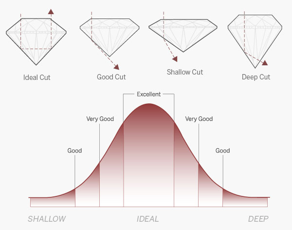
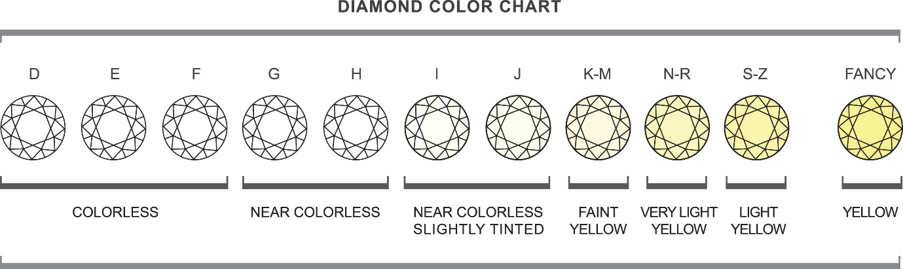
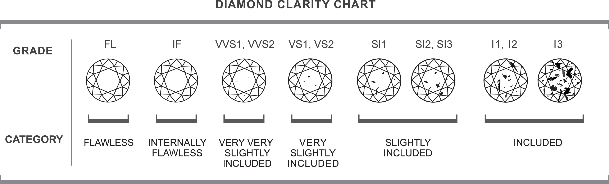
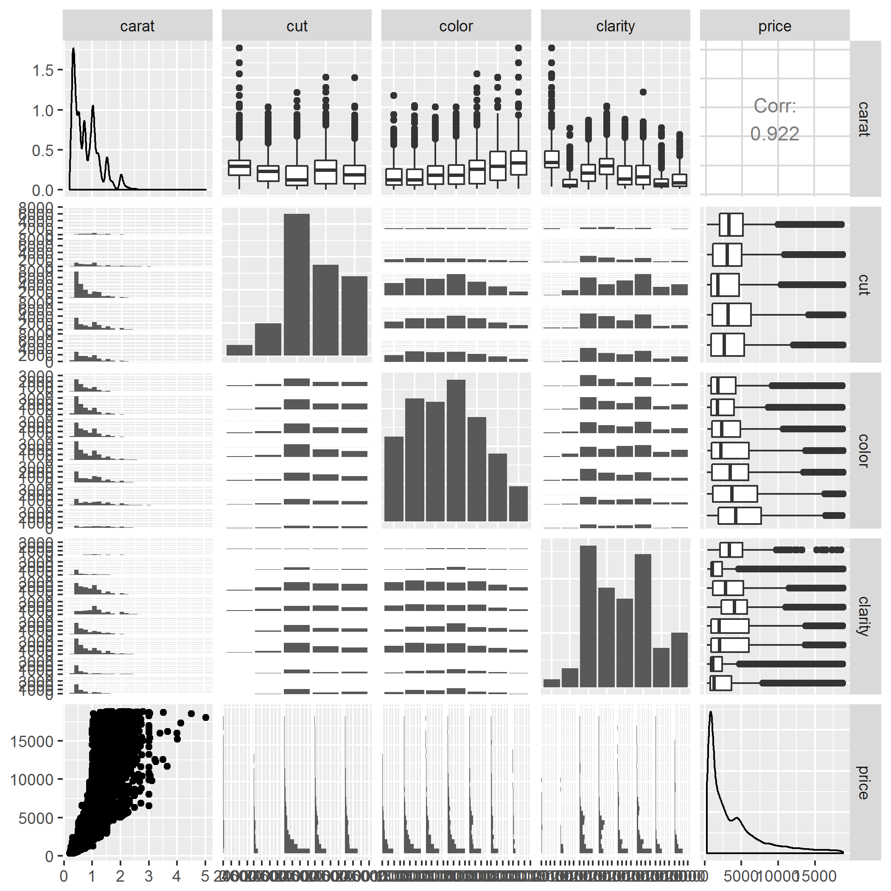
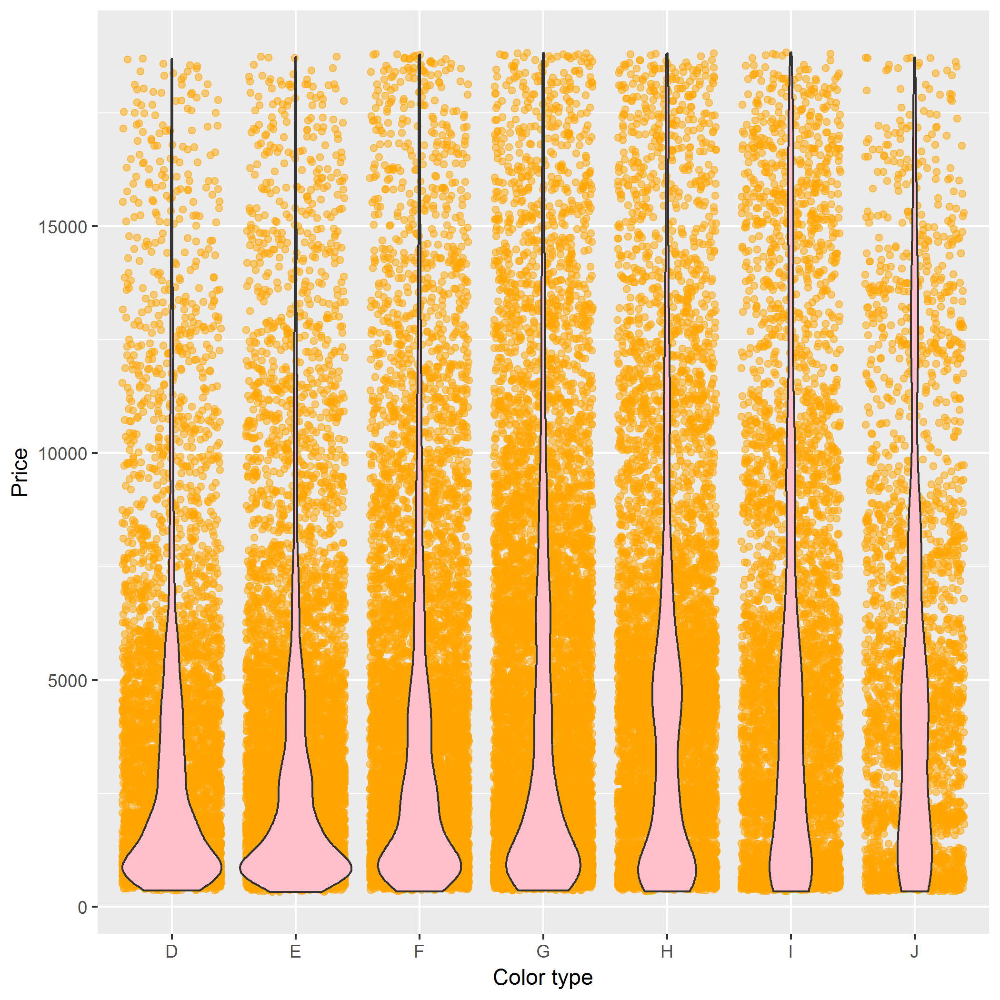
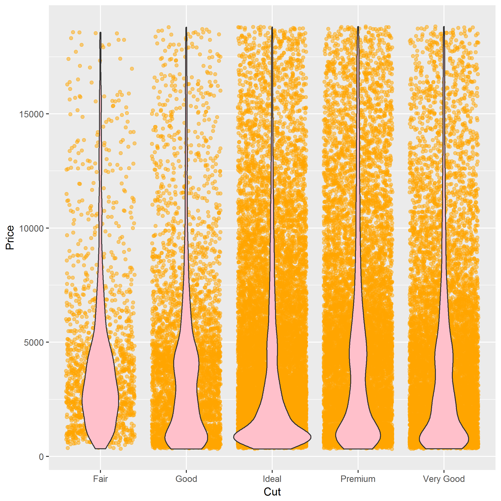
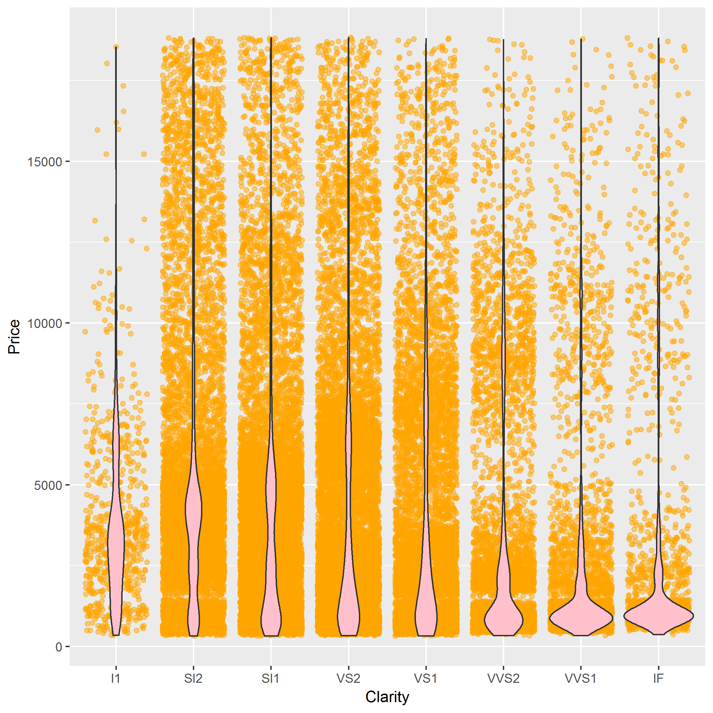
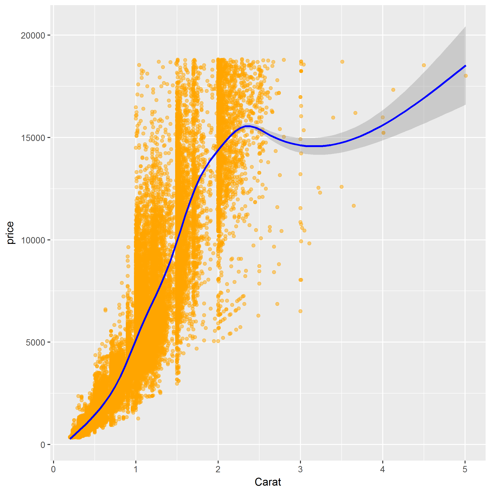

> This is the forth script: report.Rmd        
Duong Vu, Dec 2017        
The purpose of this script is to create a report.  
This script reads the clean-up data exported by the read_data.R, includes some visulizations of the relationship between variables and shows the result table of the model.R script.          
The final report will be saved into a .pdf file in `results` folder. 

> Usage:             
 Rscript report.Rmd 


```r
library(tidyverse)
```

```
## Warning: package 'tidyverse' was built under R version 3.4.3
```

```
## Warning: package 'ggplot2' was built under R version 3.4.3
```

```
## Warning: package 'tidyr' was built under R version 3.4.3
```

```
## Warning: package 'readr' was built under R version 3.4.3
```

```
## Warning: package 'purrr' was built under R version 3.4.3
```

```
## Warning: package 'forcats' was built under R version 3.4.3
```


# The diamond project

This project is looking into the relationship between color and carat of a diamond to see how the combination of those two characters can affect the price of a diamond.

The dataset is from ggplot2 package and it has information of 53,940 diamonds. After cleaning the dataset to get only the information needed, I have five variables for each diamond:

1. Cut: the quality of the cut (Fair, Good, Very Good, Premium, Ideal)


2. Carat: is a measure of a diamond weight ( 1 carat = 0.2 grams)

3. Colour: there are six levels of colourm from J (worst) to D (best)


4. Clarity: a measure of how clear the diamond is: I1 (worst), SI1, SI2, VS1, VS2, VVS1, VVS2, IF (best).


5. Price: in USD


## Reading the data

Take a look at first 10 lines of the dataset containing information about carat, cut, color, clarity and correspondent price of each diamond.


```r
diamonds_tiny <- read.csv("../data/diamonds_tiny.csv")
```

```
## Warning in file(file, "rt"): cannot open file '../data/diamonds_tiny.csv':
## No such file or directory
```

```
## Error in file(file, "rt"): cannot open the connection
```

```r
head(diamonds_tiny, 10)
```

```
## Error in head(diamonds_tiny, 10): object 'diamonds_tiny' not found
```

## Overview of the data:

First, I consider the relationship between diamond price with each of its feature: color, cut, clarity and carat.

### The correlation between pair-wise variables of the dataset:



### The correlation between color and price of a diamond:


### The correlation between cut and price of a diamond:


### The correlation between clarity and price of a diamond:



### The correlation between carat and price of a diamond:


## Modelling the data:

When I fit the two concerned variables (colour and carat) into a linear model, the result is shown below:


```r
result <- read.csv("../data/model.csv")
```

```
## Warning in file(file, "rt"): cannot open file '../data/model.csv': No such
## file or directory
```

```
## Error in file(file, "rt"): cannot open the connection
```

```r
result
```

```
## Error in eval(expr, envir, enclos): object 'result' not found
```

Our hypothesis is that there is no linear correlation between all type of colour and carat with regards to diamond price.

From the result above, we can see some connections between colour types and carat with regards to diamond prices. 

The mean price of a 1 carat, colour D diamond is \$8408 more than a 0 carat D colour. This means the mean price of a 1-carat colour D diamond is \$6000.

For all other colour (E, F, G, H, I, J): the mean price difference between colour D and each of these colours of a 0 carat diamond is equal to the estimated beta associated with the colour: -20, -304.79, -214.51, -99.40, -517.13, -559.59 (USD). The p-value of all these hypotheses are very small, so we can reject the Null hypothesis that there is no linear correlation between colour and diamond price (except for colour E). In the case of colour E, the p-value is higher than the threshold of 5%, so we cannot reject its hypothesis.

**The main focus** here is the relationship between carat and colour. It seems like the p-value of each testing for carat and each colour are very small and so we are statistical confidence to **reject the Null hypothesis** that there is no linear correlation between carat and colour with regards to diamond price. 

We can see this line `carat:colourE  -112.14`. This means that the effect of carat on colour E is \$112.14 less than the effect of carat on colour D. Similarly, we have all the estimated effect of carat on difference diamond colours.


