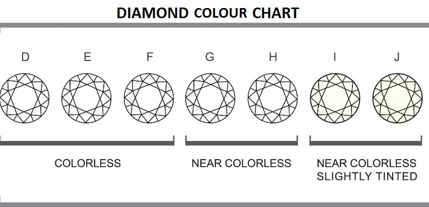

> This is the forth script: report.Rmd        
Duong Vu, Dec 2017        
The purpose of this script is to create a report    
This script reads the clean-up data exported by the read_data.R, includes some visulizations of the relationship between variables and shows the result table of the model.R script.          
The final report will be saved into a .md file in `results` folder. 

> Usage:             
 Rscript report.Rmd 

```{r setup, include=FALSE}
knitr::opts_chunk$set(echo = TRUE)
```

```{r lib, message=FALSE}
library(tidyverse)
```

```{r}
args <- commandArgs(trailingOnly = TRUE)
input <- args[1]
```

# The diamond project

This project is looking into the relationship between color and carat of a diamond to see how the combination of those two characters can affect the price of a diamond.

The dataset is from ggplot2 package and it has information of 53,940 diamonds. After cleaning the dataset to get only the information needed, I have five variables for each diamond:
- Cut: the quality of the cut (Fair, Good, Very Good, Premium, Ideal)


- Carat: is a measure of a diamond weight ( 1 carat = 0.2 grams)

- Colour: there are six levels of colourm from J (worst) to D (best)


- Clarity: a measure of how clear the diamond is: I1 (worst), SI1, SI2, VS1, VS2, VVS1, VVS2, IF (best).


- Price: in USD


## Reading the data

Take a look at first 10 lines of the raw data containing information about carat, cut, color, clarity and correspondent price of each diamond.

```{r}
diamonds_tiny <- read.csv("../data/diamonds_tiny.csv")

head(diamonds_tiny, 10)
```

## Overview of the data:

First, I consider the relationship between diamond price with eachc of its feature: color, cut, clarity and carat.


```{r}
summary(lm(price~carat*color, data = diamonds_tiny))

broom::tidy(lm(price~carat*color, data = diamonds_tiny))
```

The mean price of a 1 carat, colour D diamond is \$8408 more than a 0 carat D color. --> The mean price of a 1 carat colour D diamond is \$6000.

for all other colour (E,F,G...): the mean price difference between colour D and other colour of a 0 carat diamond ( = the estimated beta associated with the colour)

carat:colorE  -112.14 : The effect of carat on colour E is \$112.14 less than the effect of carat on colour D.